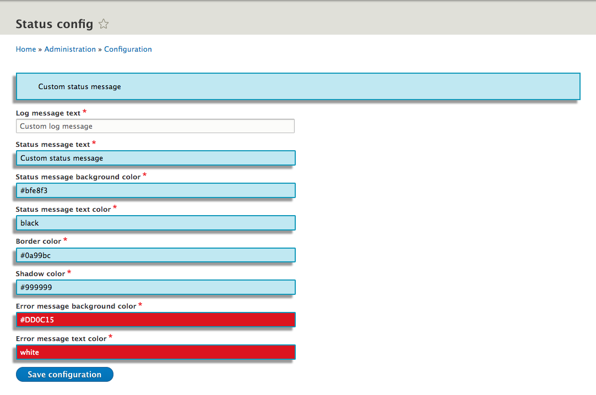
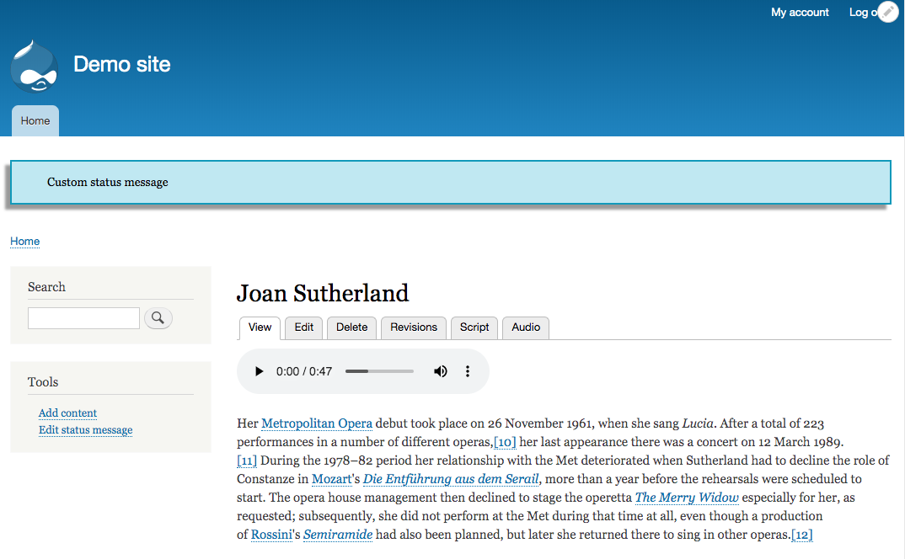
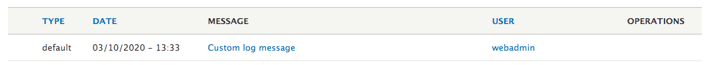

## Assignment: Write a Drupal 8 module that does three things:

1. Adds a log message that gets called on every request before any controller is called.

2. Adds a status message on every request before any controller is called.

3. When this status message is rendered, change the status message default background color, border color and box shadow to a different color scheme of your choosing.

# Status config module

1. Install and enable as a Drupal 8 module in the usual way.

2. Configuration form is at:
/admin/config/status_config/settings

### Configuration page

### Status page

### Log sample

